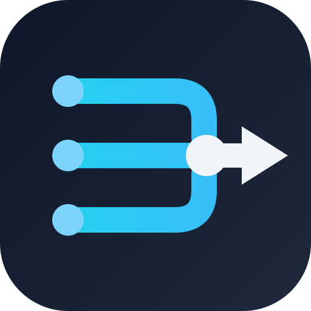

<p align="center">
  
</p>

<h1 align="center">PipeViz</h1>

<p align="center">Paste a Jenkinsfile. See your pipeline.</p>

| | |
|---|---|
| Created | Saturday, 22 August 2026 at 01:36 EDT |
| Last updated | Saturday, 22 August 2026 at 01:52 EDT |
| Status | Pre release, planning done, implementation starting |
| License | [GPL-3.0](LICENSE) |

## Table of Contents

1. [What Is PipeViz](#1-what-is-pipeviz)
2. [Current Status](#2-current-status)
3. [Planned Features](#3-planned-features)
4. [Tech Stack](#4-tech-stack)
5. [Repository Layout](#5-repository-layout)
6. [Local Development](#6-local-development)
7. [Documentation](#7-documentation)
8. [Branding](#8-branding)
9. [License](#9-license)

## 1. What Is PipeViz

PipeViz is a browser based tool that turns Jenkins pipeline definitions into an interactive visual graph. You paste or upload a Jenkinsfile, the app parses it entirely client side, and renders stages, parallel branches, conditions, and steps as a horizontal stage graph in the style made familiar by Jenkins Blue Ocean.

No backend, no accounts, no pipeline code leaving your machine. The whole thing is a static site hosted on GitHub Pages.

## 2. Current Status

The project is in active early development. Shipped so far:

- Project plan covering architecture, parser design, data model, layout algorithm, testing, and deployment ([project_plan.md](project_plan.md))
- Commit tracking conventions and log ([commit_tracker.md](commit_tracker.md))
- Logo and favicon assets (`public/`)

Not yet built: application code, parser, UI, deployment pipeline. See [Milestones](project_plan.md#14-milestones) for the build order.

## 3. Planned Features

- Parse declarative Jenkinsfiles: stages, parallel blocks, matrix blocks, sequential nested stages, `when` conditions, `post` handlers, agent and environment metadata
- Basic scripted pipeline support by detecting `stage('name')` calls
- Interactive graph rendered with React Flow: pan, zoom, minimap, node selection
- Stage details panel showing steps and raw condition text on click
- Input by paste, file upload, or bundled sample pipelines
- Graceful failure: parse errors report line numbers alongside a partial graph, never a blank screen
- Automatic deployment to GitHub Pages on push to main

## 4. Tech Stack

Versions verified against the npm registry on Saturday, 22 August 2026:

| Layer | Choice | Version |
|---|---|---|
| Build tool | [Vite](https://www.npmjs.com/package/vite) | 8.2.2 |
| UI framework | [React](https://www.npmjs.com/package/react) | 19.2.8 |
| Language | [TypeScript](https://www.npmjs.com/package/typescript) | 7.0.2 |
| Graph rendering | [@xyflow/react](https://www.npmjs.com/package/@xyflow/react) (React Flow 12) | 12.11.3 |
| Test runner | [Vitest](https://www.npmjs.com/package/vitest) | 4.1.11 |
| Linting | [ESLint](https://www.npmjs.com/package/eslint) | 10.9.0 |
| Runtime | [Node.js](https://nodejs.org/) | 24 LTS |

## 5. Repository Layout

```
PipeViz/
  .github/workflows/   GitHub Pages deploy workflow
  public/              logo.svg, favicon.svg (static assets)
  project_plan.md      architecture, milestones, risks, sources
  commit_tracker.md    commit conventions and running log
  LICENSE              GNU GPL v3
```

## 6. Local Development

Nothing runnable yet. The Vite scaffold lands with milestone M0, after which this section documents the standard commands:

```bash
npm install     # install dependencies
npm run dev     # start dev server with hot reload
npm run test    # run parser and layout unit tests
npm run build   # production build into dist/
npm run lint    # ESLint
```

Prerequisites once scaffolding lands: Node.js 24+ and npm 12+.

## 7. Documentation

| Document | Contents |
|---|---|
| [project_plan.md](project_plan.md) | Full plan: goals, architecture, parser and layout design, data model, milestones, risks, verified sources |
| [commit_tracker.md](commit_tracker.md) | Conventional commit conventions, complete history, planned commit sequence mapped to milestones |

## 8. Branding

Logo concept: **The Branch**, three parallel lanes merging into one flow, drawn as a cyan gradient on a dark rounded badge with a white output arrow. Files live in [`public/`](public/):

- `public/logo.svg` : header mark and social preview base
- `public/favicon.svg` : browser tab icon

Design tokens and usage rules are documented in [project_plan.md, Branding section](project_plan.md#branding).

## 9. License

Released under the [GNU General Public License v3.0](LICENSE).
